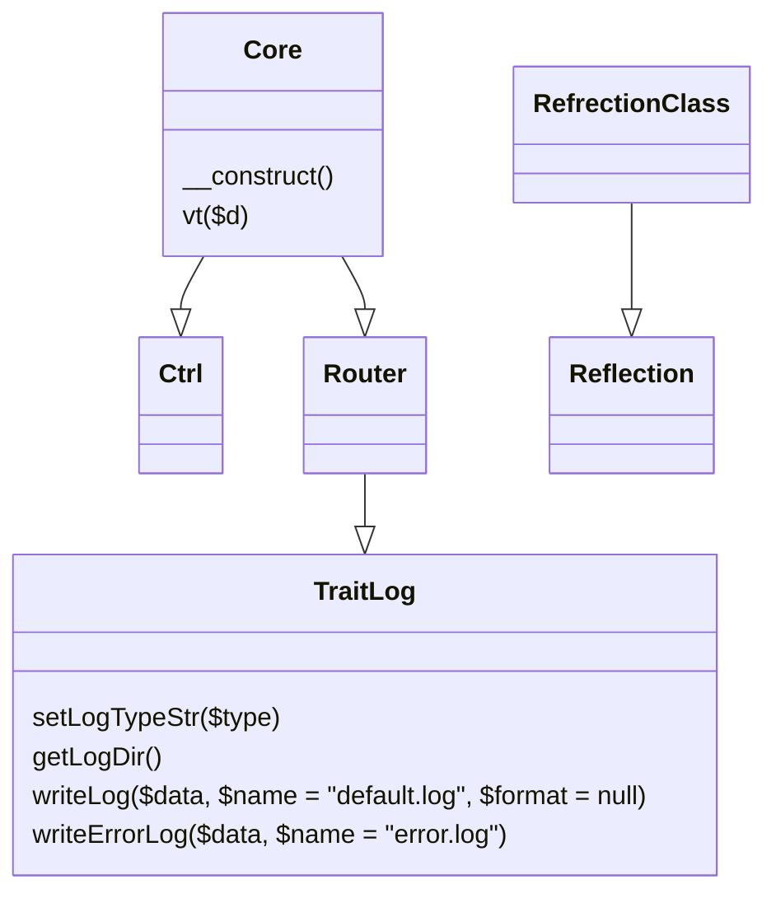

```mermaid
classDiagram
Core --|> Ctrl
Core --|> Router
RefrectionClass --|> Reflection
Router --|> TraitLog
Core : __construct()
Core : vt($d)
TraitLog : setLogTypeStr($type)
TraitLog : getLogDir()
TraitLog : writeLog($data, $name = "default.log", $format = null)
TraitLog : writeErrorLog($data, $name = "error.log")
```
